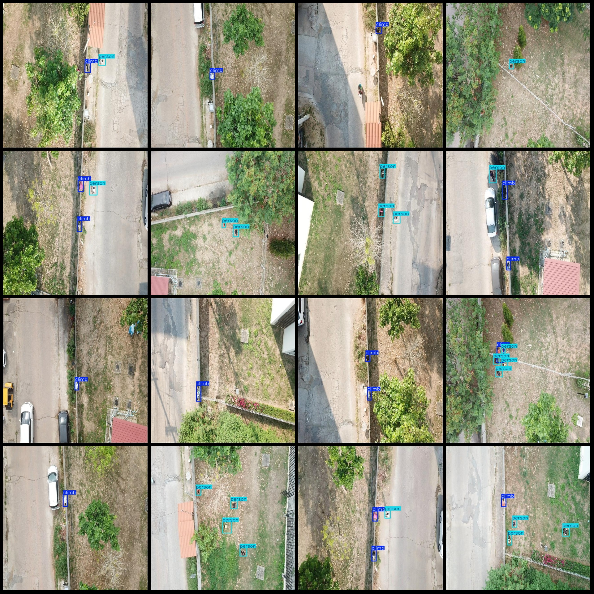
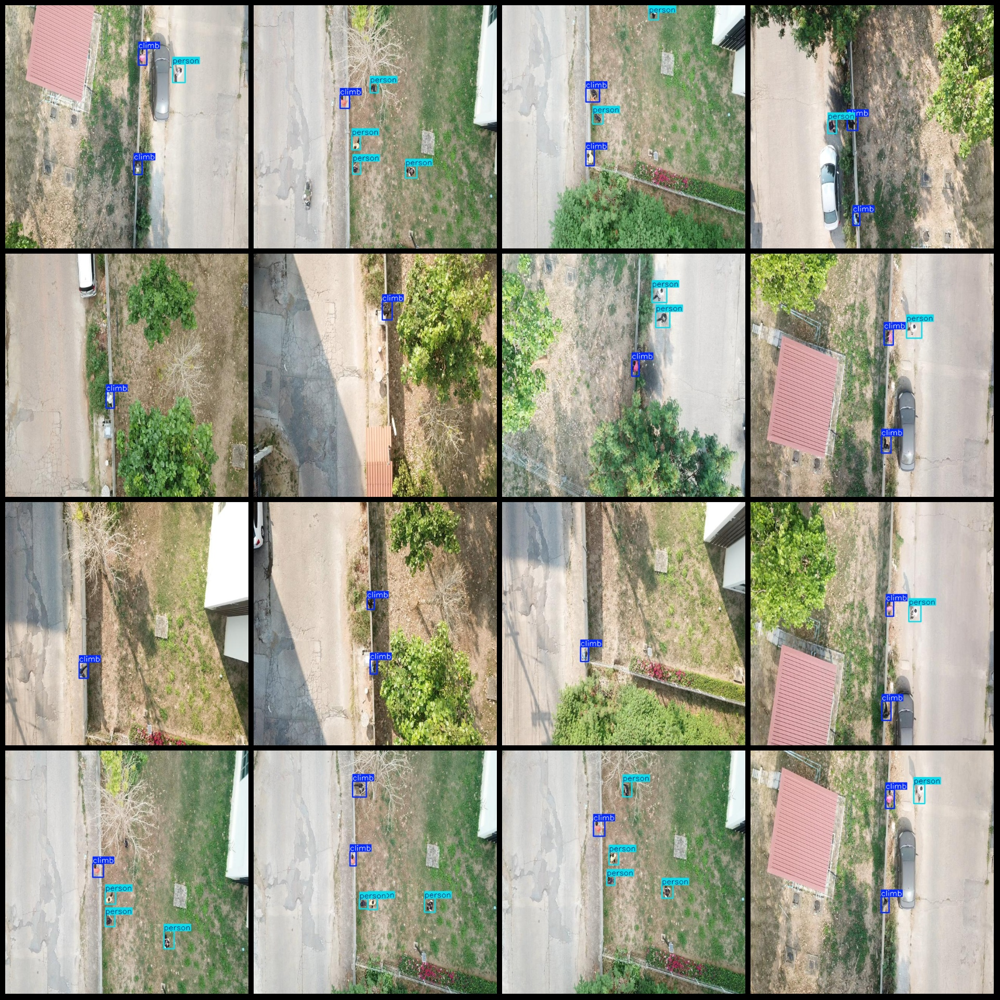

# Drone Perspective Climb Wall and Cross Courtyard Industrial Security Detection Data Set (VOC+YOLO) - Format 1704 Images with 2 Categories

Dataset Format: Pascal VOC format plus YOLO format (without split path in txt file, only containing jpg images and corresponding VOC format xml files and YOLO format txt files)
Number of Images (jpg file count): 1704
Number of Annotations (xml file count): 1704
Number of Annotations (txt file count): 1704
Number of Annotation Categories: 2
Annotation Category Names (Note that the order of categories in YOLO format does not correspond to this, but is based on the labels folder 'classes.txt'): ["climb", "person"]
Number of Boxes per Category:
- climb boxes = 2028
- person boxes = 2315
Total Boxes: 4343
Number of Images per Category:
- climb images = 1354
- person images = 1167
Image Resolution: 640x640
Drone: DJI MAVIC 3
Collection Height: 50m
Collection Angle: 90°
Annotation Tool: labelImg
Annotation Rules: Draw a box around the category
Important Notice: The dataset does not have been divided into training, validation, or test sets; please do so yourself.
Special Notice: This dataset does not guarantee the accuracy of the trained model or weight files.
Image Preview:
Annotation Example:

## Images

Here is a pay link on Stripe ( https://buy.stripe.com/3cs8yP7sY87d0vu9AB ). Please contact me lonlonago@foxmail.com after funding $89, and I will send you a complete data files , thank you!

